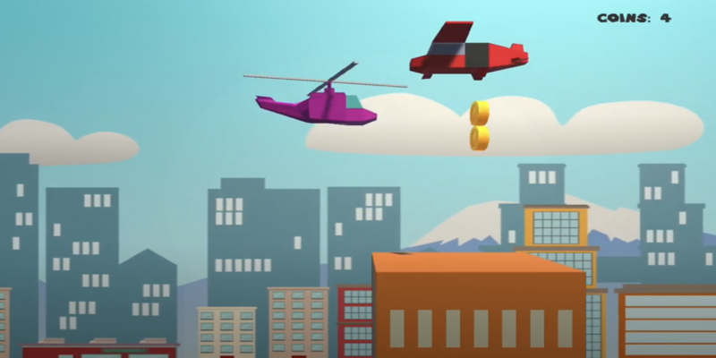

# 3D Helicopter Game

A Unity 3D game where players pilot a helicopter through a series of procedurally generated obstacles and terrain. Created for CS50's Game Development course.



## Description

This project challenges players to navigate a helicopter through an obstacle course using physics-based controls and momentum. The game features:

- Helicopter movement using Unity's Rigidbody physics
- Procedural generation of terrain and hazards
- Increasing difficulty as players progress
- Particle effects and smooth camera tracking

## How to Play

### Controls

- `W/S`: Tilt forward/backward  
- `A/D`: Rotate the helicopter  
- `Space`: Gain lift / ascend  
- `Shift`: Boost speed  
- `Esc`: Pause or exit

### Objective

Fly as far as you can without crashing. Navigate through moving and stationary obstacles, balancing lift, speed, and rotation.

## Development

### Built With

- Unity Engine (Version [insert version you used])  
- C# for scripting  
- Unity's physics and particle systems  
- Procedural terrain logic  

### Project Structure

- `Assets/`: Game content (scripts, prefabs, models)  
- `Scenes/`: Game levels and menus  
- `Scripts/`: Helicopter control, obstacle generation, game logic  
- `Prefabs/`: Reusable game objects  
- `ProjectSettings/`: Unity project configuration  
- `Packages/`: Unity package references  

## Installation and Setup

1. Clone the repository
   ```bash
   git clone https://github.com/ethanperello/3d-helicopter-game.git
   ```
2. Open the project in **Unity Hub**
3. Select the scene from `Assets/Scenes/` to begin

## Demo

[Watch the gameplay demo](https://www.youtube.com/watch?v=l4muAD4axtU)

## Credits

- Developed by Ethan Perello  
- Created as part of CS50's Game Development course  
- 3D models and particle assets from Unity Asset Store and Kenney.nl
